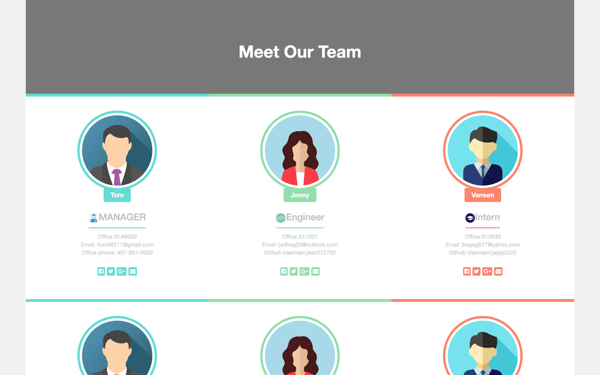

# Team_Profile_Generator
  [](https://github.com/tterb/atomic-design-ui/blob/master/LICENSEs)     
      
  Example_page : https://zst199394.github.io/Team_Profile_Generator/
  ## Description
  The project is to build a Node.js command-line application that takes in information about employees on a software engineering team, then generates an HTML webpage that displays summaries for each person.
  Testing is key to making code maintainable, so you’ll also write a unit test for every part of your code and ensure that it passes each test.
  Because this application won’t be deployed, I’ll need to provide a link to a walkthrough video that demonstrates its functionality and all of the tests passing. Here's a link of the video gif :
  
  


  ## Table of contents
  - [Description](#Description)
  - [Installation](#Installation)
  - [Usage](#Usage)
  - [License](#License)
  - [Contributing](#Contributing)
  - [Test](#Test)
  - [Repository Link](#Repository)
  - [GitHub Info](#GitHub) 

  ## Installation
   The installation instructions:    Use a library like Moment.js to work with dates and times. Moment.js has historically been the most popular date/time library but is no longer supported by its developers. However, you can still use it for this project, or you can look into one of the following alternatives:     - [Luxon](https://moment.github.io/luxon/)     - [Day.js](https://day.js.org/)     - [date-fns](https://date-fns.org/)     - [js-Joda](https://js-joda.github.io/js-joda/)

  ## Usage
  ```md
  AS A manager
  I WANT to generate a webpage that displays my team's basic info
  SO THAT I have quick access to their emails and GitHub profiles
 ```

  ## Licence
  
  
  ## Contributing
  [](https://GitHub.com/Naereen/)
  [](http://ForTheBadge.com)  
       Developer : Shuting Zhao


  ## GitHub
  My Github Username : zst199394
  - [GitHub Profile](http://github.com/zst199394)

  
  ## Reach Me 
  My email : zst9394@outlook.com
  - [Email address](zst9394@outlook.com)
